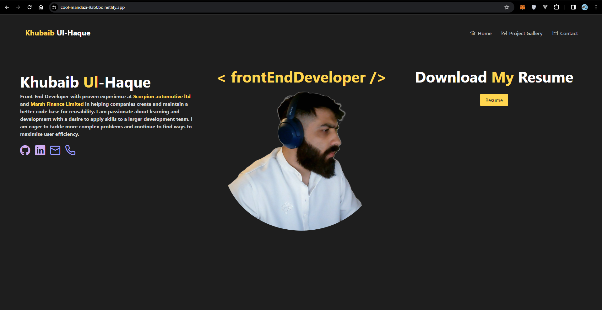
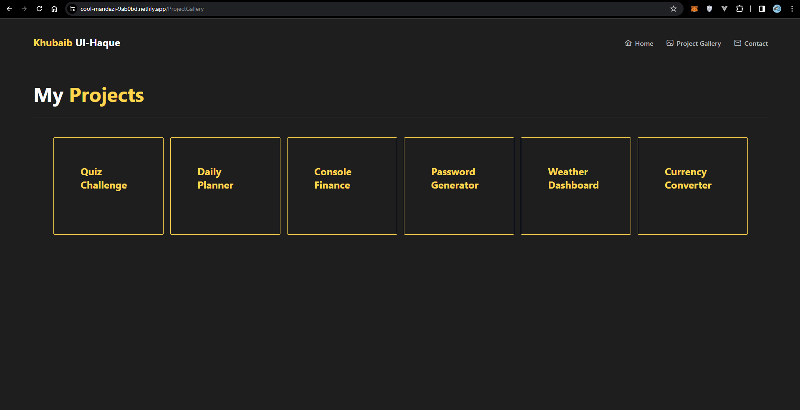
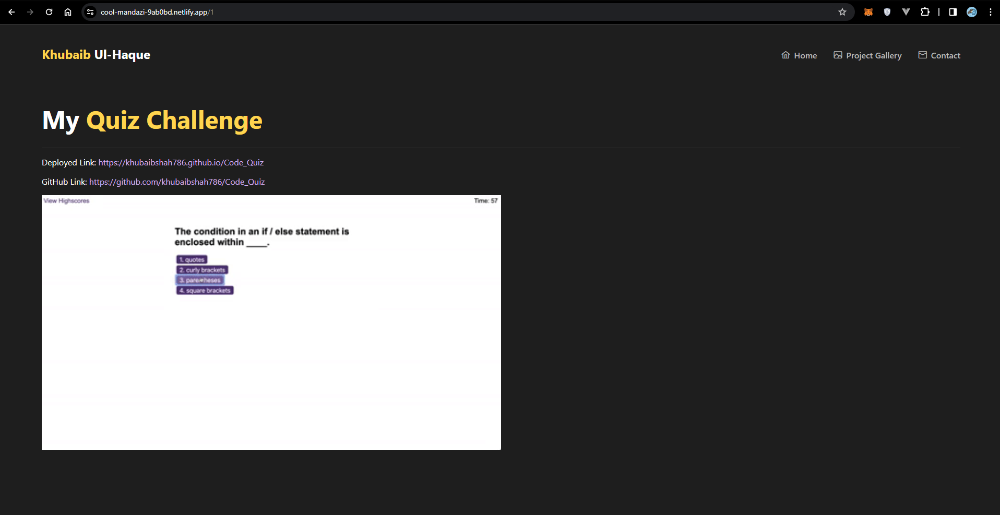
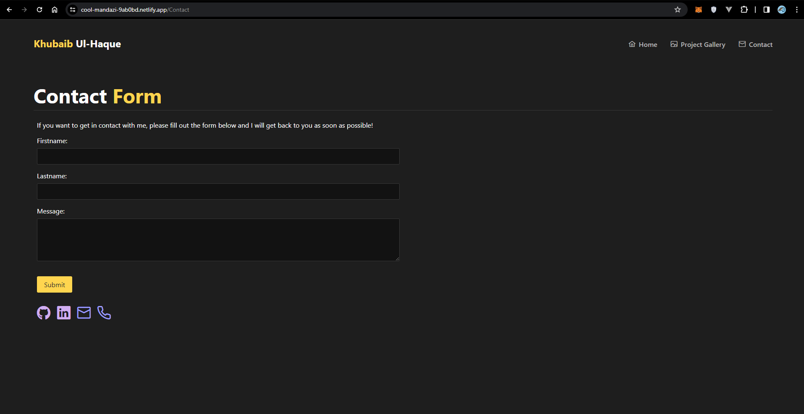

# React_Portfolio

## Technologies Used

## Table of Contents

- [Description](#description)
- [User Story](#user-story)
- [User Acceptance](#user-acceptance-criteria)
- [User Acceptance](#user-acceptance-criteria)
- [Features](#features)
- [User Acceptance Criteria](#user-acceptance)

# Description 

Welcome to my React portfolio! This portfolio is a showcase of the projects I completed during my journey as a front-end developer. Designed with React, it offers a glimpse into my skills, creativity, and dedication to crafting engaging web applications.

I created this portfolio with the intention of presenting my capabilities as a front-end developer. Each project featured here is a testament to my learning and growth throughout my front-end developer course. From dynamic navigation using React Router to polished UI components, every aspect of this portfolio reflects my commitment to excellence in web development.

The projects showcased in this portfolio are a culmination of my dedication and passion for front-end development. Each project includes:

- Project Title: The name of the project.
- Deployed Version: Link to the live version of the project.
- GitHub Repository: Link to the project's GitHub repository.
- Screenshot/GIF: Visual representation of the project's interface.

## Required Components

To meet the criteria for a comprehensive portfolio, I ensured the inclusion of the following components:

- App: The central component orchestrating the entire portfolio.
- Header: Providing navigation and essential links.
- Home Page: Offering an introduction to the portfolio and its purpose.
- Projects Page: Showcasing all the projects I've completed.
- Project Component: Detailing each project with links and visuals.
- Contact Page: Facilitating communication through various channels.

## User Acceptance Criteria

- Each of the following components must follow these guidelines:

- App:

1. Must be your top-level component and render all necessary child components
Header:

2. Must be rendered across every page component of the site

3. Must contain a Navbar

- Home page:

1. This should be a welcome landing page that contains:

2. Your Name

3. A headshot of you (or an avatar)

4. Your brand statement

5. Some indication that this is your portfolio site

- Projects page:

1. Must render six instances of the Project component dynamically

2. Be sure to store your project details data in a JSON file and import it into your project

- Project:

1. Must be a reusable component that ingests JSON data as props and renders a single instance for each project

2. Must utilize Router props to properly render the right project based on user selection

3. Must render the following info:

- Project title

1. Link to the deployed version

2. Link to the GitHub repository

3. GIF or screenshot of the deployed application

- Contact page:

1. Must include contact information:

2. Email address

3. Link to a PDF version of your CV

4. Link to your GitHub profile

5. Link to your LinkedIn page

6. Must have a contact form for handling events

## Screenshot(s)

## Repository Setup Instructions
### 1. Clone the Repository:
- git clone [Click here](https://github.com/khubaibshah786/React_Portfolio)

### 5. Deploy to Netlify:
After completing my React Profolio, i deployed it to netlify for public access.
[Click here](https://cool-mandazi-9ab0bd.netlify.app/)

### Technologies Used
- HTML
- Javascript
- React
- PrimeReact
- PrimeIcons
- PrimeFlex
- CSS

 ## Deployed application

 - Click here [live Site](https://cool-mandazi-9ab0bd.netlify.app/)